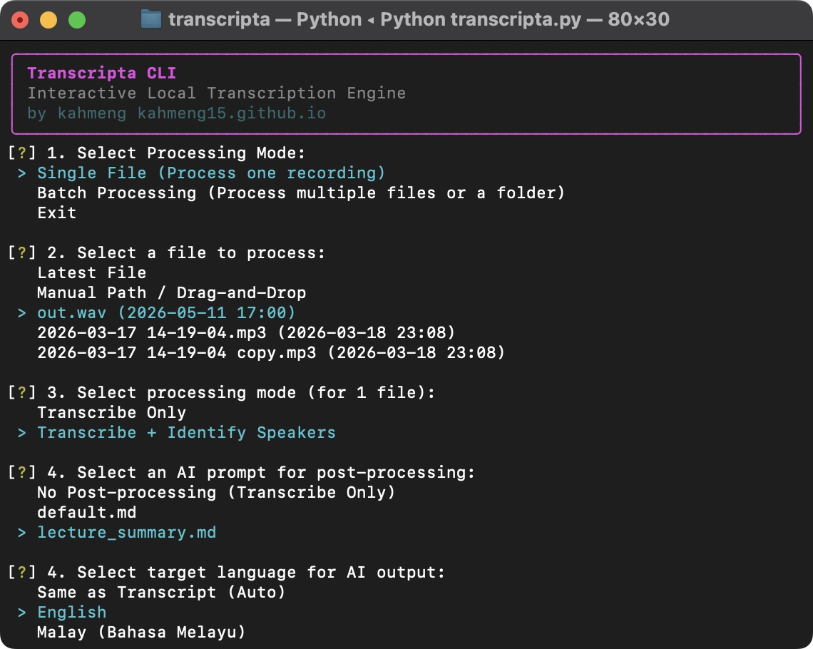

# Transcripta CLI


### Interactive Local AI Transcription & Summarization Engine
**by kahmeng [kahmeng15.github.io](https://kahmeng15.github.io)**

Transcripta is a powerful, macOS-optimized CLI tool designed for high-fidelity transcription and AI-driven post-processing. It leverages **MLX-Whisper** for lightning-fast transcription on Apple Silicon and **Pyannote** for accurate speaker identification (diarization).

---

## 🚀 Key Features

- **Apple Silicon Optimized:** Uses MLX-Whisper for high-performance transcription on Mac.
- **Speaker Diarization:** Automatically identifies and labels different speakers in the audio.
- **AI Summarization:** Built-in support for **Google Gemini** (with fallback logic) and **OpenAI**.
- **Collection Mode:** Drag-and-drop support for files and folders directly into the terminal.
- **Batch Processing:** Queue up multiple files or entire directories for automated processing.
- **Multilingual Support:** Advanced handling for mixed-language audio (e.g., Malay + English).
- **Self-Contained:** AI models are stored locally within the project directory.

---

## 📋 Prerequisites

1.  **macOS:** Highly recommended (optimized for Apple Silicon).
2.  **FFmpeg:** Required for audio extraction.
    ```bash
    brew install ffmpeg
    ```
3.  **Python 3.9+:** Ensure you have a modern version of Python installed.
4.  **Hugging Face Account:** Required to access the diarization models.
    **You MUST visit and accept the terms for ALL three models below:**
    - [1. Speaker Diarization 3.1](https://hf.co/pyannote/speaker-diarization-3.1)
    - [2. Segmentation 3.0](https://hf.co/pyannote/segmentation-3.0)
    - [3. Speaker Diarization Community](https://hf.co/pyannote/speaker-diarization-community-1)

---

## 🛠️ Installation

1.  **Clone the Repository:**
    ```bash
    git clone https://github.com/kahmeng15/transcripta.git
    cd transcripta
    ```

2.  **Create a Virtual Environment:**
    ```bash
    python3 -m venv .venv
    source .venv/bin/activate
    ```

3.  **Install Dependencies:**
    ```bash
    pip install -r requirements.txt
    ```

---

## ⚙️ Configuration

1.  **Create your `.env` file:**
    ```bash
    cp .env.template .env
    ```

2.  **Fill in your API Keys:**
    - `HUGGINGFACE_TOKEN`: Get this from [Hugging Face Settings](https://huggingface.co/settings/tokens).
    - `GEMINI_API_KEY` or `OPENAI_API_KEY`: Depending on your preferred summarizer.

3.  **Fine-tune Settings (Optional):**
    - `WHISPER_LANGUAGE`: Set to `ms` for Malay, `en` for English, or `auto`.
    - `WHISPER_PROMPT`: Use this to "nudge" the AI for better multilingual accuracy (e.g., Manglish/Bahasa Rojak).

---

## 🕹️ Usage

### Quick Start (Single Command)
You can launch the application instantly using the provided scripts (they auto-activate the environment):
- **macOS:** Double-click `run_mac.command` in Finder (or run `./run_mac.command` in terminal).
- **Linux:** `./run_linux.sh`
- **Windows:** Double-click `run_win.bat`

### Manual Run
If you prefer running it manually, you must activate your environment first:
```bash
# macOS / Linux
source .venv/bin/activate
python transcripta.py

# Windows
.venv\Scripts\activate
python transcripta.py
```

### Processing Modes

- **Single File Mode:** Select a file from your `input_media` folder or drag-and-drop a specific file path.
- **Batch Processing Mode:** 
  - **Select Multiple:** Pick several files from your input folder using a checkbox list.
  - **Collection Mode:** Drag and drop multiple files/folders one by one. Type `d` when your queue is ready.

### Processing Options

- **Transcribe Only:** Fast mode for simple text output.
- **Transcribe + Identify Speakers:** Full pipeline including diarization (takes longer).
- **AI Post-processing:** Choose from your Markdown prompts in the `prompts/` folder and select your target output language (English, Malay, or Auto).

---

## 📂 Project Structure

- `input_media/`: Place your audio/video files here for quick selection.
- `output_files/`: Transcriptions and AI summaries are organized here by filename.
- `prompts/`: Add your own `.md` files here to create custom AI post-processing behaviors.
- `models/`: All AI models (Whisper, Pyannote) are stored locally here.
- `temp/`: Temporary audio processing files (automatically cleared on exit).

---

## 📜 License

This project is licensed under the MIT License - see the [LICENSE](LICENSE) file for details.
